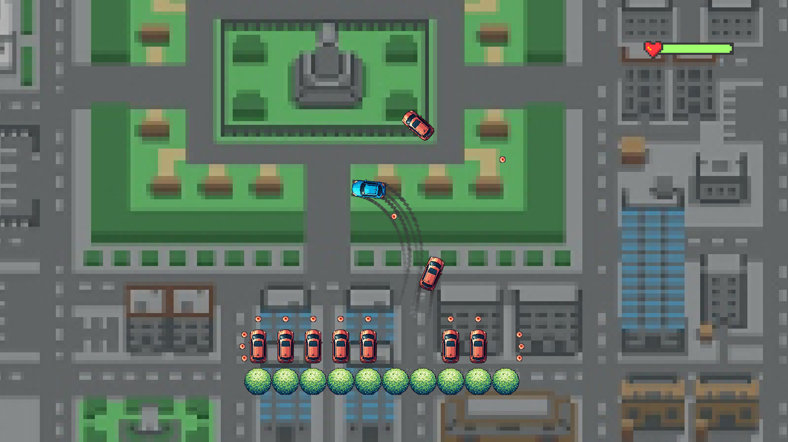

# Ultimate Parking

HSE second course final project about teaching AI to play parking game.




## Description

The game is a 2D parking simulator. The player has to park a car in a parking spot. The car is controlled by the player
using the WASD keys + space for hand brake. The car has to be parked in a parking spot without hitting any obstacles.
The game is over when the car hits an obstacle or the parking spot. The game is won when the car is parked in the
parking spot.

Special features:

- Park Me: make parking to parking slot with the most amount of points.
- Survival: be the last car alive, don't give bots make you crash.
- A->B: make the car go from point A to point B.

Special keys:

- f6 - screenshot

## Installation

```shell
pip install -r requirements.txt

python ./main.py
```

# Development setup

Create env:

```shell
python -m venv ultimate_parking

.\ultimate_parking\Scripts\activate

pip install -r requirements.txt
```

Save install:

```shell
pip freeze > requirements.txt
```

Build debug

```shell
python ./main.py
```

Check build release:

```shell
mypy .

pyinstaller.exe ./main.py

.\build\main\main.exe
```

## Team

- [Alexander Serkov](https://github.com/setday/)
- [Vladimir Zakharov](https://github.com/yv0vaa/)
- [Artem Batygin](https://github.com/Tematikys/)
